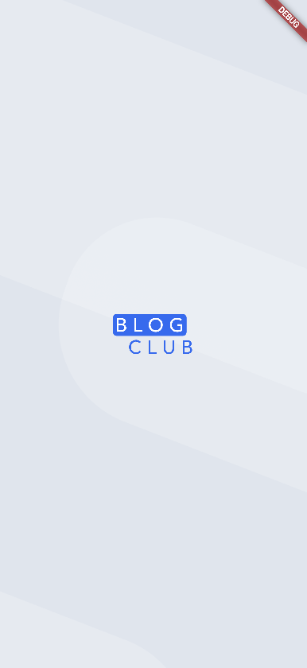

# Blog Club | بلاگ کلاب

Blog Club is a social network-style mobile application built with Flutter.  
بلاگ کلاب یک اپلیکیشن شبکه اجتماعی است که با Flutter ساخته شده است.  
It allows users to read and write articles, manage their profiles, and interact with other users.  
این برنامه به کاربران اجازه می‌دهد مقالات را بخوانند و بنویسند، پروفایل خود را مدیریت کنند و با دیگر کاربران تعامل داشته باشند.

## Screens / Pages | صفحات برنامه
The app includes the following main pages:  
برنامه شامل صفحات اصلی زیر است:

- **Splash / اسپلش** – Welcome screen when the app launches / صفحه خوش‌آمدگویی هنگام باز شدن برنامه  
- **Login / ورود** – User authentication / صفحه ورود کاربران  
- **Signup / ثبت‌نام** – User registration / صفحه ثبت‌نام کاربران  
- **Home / خانه** – Main feed of articles / فید اصلی مقالات  
- **Profile / پروفایل** – User profile page / صفحه پروفایل کاربر  
- **Article / مقاله** – Detailed view of a single article / نمایش جزئیات یک مقاله  

## Features | ویژگی‌ها
- User authentication (Login / Signup) / ورود و ثبت‌نام کاربران  
- View, create, and interact with articles / مشاهده، ایجاد و تعامل با مقالات  
- Profile management / مدیریت پروفایل  
- Smooth navigation between screens / ناوبری روان بین صفحات  
- Built with Flutter for cross-platform support / ساخته شده با Flutter برای پشتیبانی از پلتفرم‌های مختلف  

## Screenshots / تصاویر برنامه

  <strong>Splash Screen</strong> 
  

  <strong>Home Screen</strong> 
  

  <strong>Profile Screen</strong> 
  

  <strong>Article Screen</strong> 
  

  <strong>Onboarding Screen</strong> 
  

  <strong>Auth Screen</strong> 
  
  

